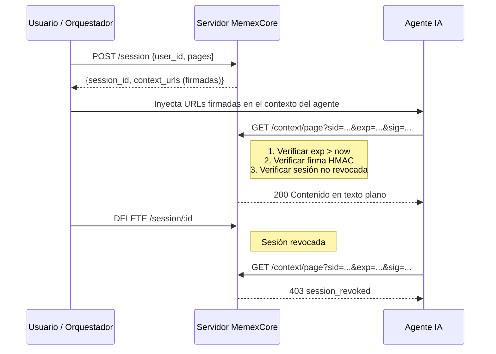

# MemexCore

[](LICENSE)
[](https://bun.sh)
[](docker-compose.yml)

[English](./README.md) | [中文](./README.zh-CN.md) | [Español](./README.es.md)

Alternativa minimalista al Model Context Protocol (MCP) para proveer contexto a agentes de IA vía HTTP estándar. En lugar de requerir protocolos custom o SDKs, MemexCore sirve **Context Pages** — documentos en texto plano entregados a través de URLs firmadas con autenticación HMAC, rotación automática de claves, rate limiting por sesión y audit logging estructurado. Construido con Bun y SQLite para mínimo footprint y cero dependencias externas.

## ¿Qué son las Context Pages?

Las Context Pages son documentos en texto plano (archivos `.txt`) que contienen la información que un agente de IA necesita para realizar una tarea — reportes de ventas, listas de clientes, fichas de producto, documentación interna, runbooks o cualquier conocimiento estructurado. Piensa en ellas como **material de referencia de solo lectura que le entregas a un agente** antes de que empiece a trabajar.

En lugar de embeber contexto directamente en prompts o depender de pipelines complejos de retrieval, MemexCore sirve estas páginas por HTTP a través de URLs firmadas con tiempo de expiración. El agente recibe una URL, consulta la página y la lee — igual que una persona abriendo un documento. Sin tool calls, sin parsing, sin SDK.

Cada página es:
- **Un simple archivo `.txt`** que tú controlas y versionas en tu propio repositorio
- **Servida bajo demanda** a través de una URL firmada con alcance de sesión
- **Efímera por diseño** — las URLs expiran, las sesiones se pueden revocar y nada se cachea

Esto hace que las Context Pages sean ideales para alimentar agentes con información actualizada y acotada, sin darles acceso amplio a bases de datos o APIs.

## ¿Por qué no MCP?

| | MemexCore | MCP |
|---|---|---|
| **Protocolo** | HTTP estándar + URLs firmadas | Protocolo custom sobre stdio/SSE |
| **Integración** | Cualquier cliente HTTP (`curl`, `fetch`) | Requiere SDK de MCP por lenguaje |
| **Modelo de auth** | URLs firmadas con HMAC y rotación automática | Depende de la implementación del transporte |
| **Setup** | Un `docker compose up` | Servidor + SDK cliente + config por agente |
| **Entrega de contexto** | Texto plano vía GET — los agentes lo leen nativamente | Tool calls que retornan objetos estructurados |

MCP es poderoso para uso bidireccional de herramientas. MemexCore es para cuando solo necesitas **darle algo de leer a un agente** — de forma segura, sin SDK, sin schema y sin ceremonia.

## Ejemplo rápido

```bash
# 1. Levantar el servidor
docker compose up -d

# 2. Crear una sesión (retorna URLs firmadas)
curl -s -X POST http://localhost:3000/session \
  -H "Content-Type: application/json" \
  -d '{"user_id": "agent-01", "pages": ["reporte-ventas"]}' | jq .

# La respuesta incluye URLs firmadas listas para usar:
# {
#   "session_id": "...",
#   "expires_at": 1234567890,
#   "context_urls": {
#     "reporte-ventas": "http://localhost:3000/context/reporte-ventas?sid=...&exp=...&sig=..."
#   }
# }

# 3. Leer contexto usando la URL firmada (no necesita header de auth)
curl -s "<url_firmada_del_paso_2>"
```

La URL firmada es todo lo que el agente necesita. Sin tokens, sin SDK, sin config.

## Cómo funciona



La validación es **puramente criptográfica** — sin consultas a base de datos en el hot path. El servidor reconstruye la firma HMAC desde los parámetros de la URL y la compara usando comparación de tiempo constante:

```
HMAC-SHA256(secret, "{session_id}:{page_id}:{exp}") == sig?
```

El agente es **completamente stateless** en términos de auth. No guarda credenciales ni renueva tokens — simplemente usa las URLs firmadas que le dieron. Cuando expiran, la sesión terminó.

### Endpoints del API

| Método | Ruta | Descripción |
|---|---|---|
| `POST` | `/session` | Crea una sesión y retorna URLs firmadas |
| `GET` | `/context/:page` | Valida HMAC y sirve texto plano |
| `GET` | `/session/:id` | Inspecciona estado de una sesión |
| `DELETE` | `/session/:id` | Revoca una sesión |
| `GET` | `/health` | Retorna `{"ok": true}` si el servidor está corriendo |

## Requisitos

- [Bun](https://bun.sh) v1.0+

## Cómo correr

### Con Docker Compose (recomendado)

```bash
docker compose up
```

Esto levanta el servidor en `http://localhost:3000`. Las context pages se leen de `example-pages/en/` por defecto y la base de datos se persiste en un volumen Docker. Para usar otro idioma o tus propias pages, cambia el volumen en `docker-compose.yml`:

```yaml
volumes:
  - ./example-pages/es:/app/pages:ro      # Ejemplos en español
  - ./example-pages/zh-CN:/app/pages:ro   # Ejemplos en chino
  - ./mis-pages:/app/pages:ro             # Tus propias pages
```

### Sin Docker

```bash
cd server && bun run start
```

### Demo rápida con expiración

```bash
SESSION_TTL=10 docker compose up
# o sin Docker:
cd server && SESSION_TTL=10 bun run start
```

## Variables de entorno

Todas las variables numéricas se validan al arranque — si el valor no es un entero positivo, el servidor no arranca y muestra el error.

| Variable | Default | Descripción |
|---|---|---|
| `SESSION_TTL` | `300` | Tiempo de vida de sesión en segundos |
| `HMAC_TTL` | `3600` | Intervalo de rotación automática de claves HMAC en segundos |
| `RATE_LIMIT_RPM` | `60` | Requests máximos por session_id por minuto |
| `PORT` | `3000` | Puerto del servidor |
| `PAGES_DIR` | `./pages` | Directorio donde se leen las context pages (`.txt`) |
| `DB_PATH` | `./data/context-pages.db` | Ruta del archivo SQLite |

## Seguridad

### Rotación de claves HMAC

Las claves HMAC se generan automáticamente y se rotan cada `HMAC_TTL` segundos (default: 1 hora). Las claves se persisten en SQLite, por lo que sobreviven reinicios. Durante la rotación, la clave anterior se mantiene válida para verificar URLs firmadas antes del cambio.

### Rate limiting

El context server limita requests por `session_id` a `RATE_LIMIT_RPM` por minuto (default: 60). Si se excede, responde `429 Too Many Requests` con header `Retry-After`.

### Audit log

Cada request al context server se loguea a stdout en formato JSON:

```json
{"ts":"2026-03-14T12:00:00.000Z","event":"page_read","session_id":"uuid","page_id":"reporte-ventas","ip":"127.0.0.1","result":"ok","sig_prefix":"a4d94dfb"}
```

Eventos: `page_read`, `token_expired`, `invalid_signature`, `session_revoked`, `rate_limited`, `page_not_found`.

### Headers de seguridad

Todas las respuestas del context server incluyen:
- `Cache-Control: no-store, no-cache, must-revalidate`
- `X-Content-Type-Options: nosniff`
- `X-Frame-Options: DENY`
- `Content-Security-Policy: default-src 'none'`
- `Referrer-Policy: no-referrer`

### Tests de seguridad

```bash
cd server && bun test src/tests/
```

## CLI

El directorio `cli/` incluye una herramienta de línea de comandos para interactuar con el servidor y generar archivos de contexto para agentes de IA.

### Instalar

```bash
cd cli && bun link
```

### Uso

```bash
# Crear una sesión y obtener URLs firmadas
context-pages session create --user agent-01 --pages reporte-ventas,clientes

# Inspeccionar una sesión
context-pages session get <session_id>

# Revocar una sesión
context-pages session delete <session_id>

# Generar un archivo CLAUDE.md con URLs firmadas listas para un agente de IA
context-pages generate --user agent-01 --pages reporte-ventas,clientes

# Generar en una ruta personalizada
context-pages generate --user agent-01 --pages reporte-ventas --output ./proyecto/CLAUDE.md
```

El comando `generate` crea una sesión y escribe un archivo Markdown con instrucciones y URLs firmadas que un agente de IA puede seguir directamente. Por defecto escribe en `./CLAUDE.md`.

### Opciones

| Flag | Descripción |
|---|---|
| `--server <url>` | URL del servidor (default: `$SERVER_URL` o `http://localhost:3000`) |
| `--user <id>` | Identificador de usuario o agente |
| `--pages <p1,p2,...>` | Lista de páginas separadas por coma |
| `--output <path>` | Ruta de salida para `generate` (default: `./CLAUDE.md`) |
| `--help` | Muestra la ayuda |

## Páginas de ejemplo

El directorio `example-pages/` contiene context pages de ejemplo en múltiples idiomas:

```
example-pages/
  en/          # Inglés
  es/          # Español
  zh-CN/       # Chino (simplificado)
```

Cada directorio contiene el mismo set de páginas demo (reporte de ventas, clientes, ficha de producto) para que puedas probar el flujo completo en tu idioma preferido. Para usar tus propias pages, solo apunta `PAGES_DIR` a cualquier directorio con archivos `.txt`.

## Licencia

[MIT](LICENSE)
