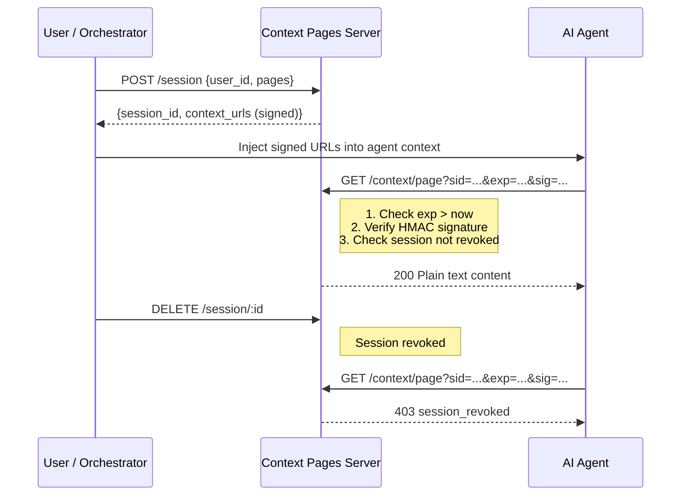

# Context Pages

[](LICENSE)
[](https://bun.sh)
[](docker-compose.yml)

[English](./README.md) | [中文](./README.zh-CN.md) | [Español](./README.es.md)

A minimalist alternative to the Model Context Protocol (MCP) for providing context to AI agents via standard HTTP. Instead of requiring custom protocols or SDKs, it serves plain-text context pages through signed URLs with HMAC authentication, automatic key rotation, per-session rate limiting, and structured audit logging. Built with Bun and SQLite for minimal footprint and zero external dependencies.

## Why not MCP?

| | Context Pages | MCP |
|---|---|---|
| **Protocol** | Standard HTTP + signed URLs | Custom protocol over stdio/SSE |
| **Integration** | Any HTTP client (`curl`, `fetch`) | Requires MCP SDK per language |
| **Auth model** | HMAC-signed URLs with auto-rotation | Depends on transport implementation |
| **Setup** | One `docker compose up` | Server + client SDK + config per agent |
| **Context delivery** | Plain text over GET — agents read it natively | Tool calls that return structured objects |

MCP is powerful for bidirectional tool use. Context Pages is for when you just need to **give an agent something to read** — securely, with no SDK, no schema, and no ceremony.

## Quick Example

```bash
# 1. Start the server
docker compose up -d

# 2. Create a session (returns signed URLs)
curl -s -X POST http://localhost:3000/session \
  -H "Content-Type: application/json" \
  -d '{"user_id": "agent-01", "pages": ["sales-report"]}' | jq .

# Response includes ready-to-use signed URLs:
# {
#   "session_id": "...",
#   "expires_at": 1234567890,
#   "context_urls": {
#     "sales-report": "http://localhost:3000/context/sales-report?sid=...&exp=...&sig=..."
#   }
# }

# 3. Fetch context using the signed URL (no auth header needed)
curl -s "<signed_url_from_step_2>"
```

The signed URL is all the agent needs. No tokens, no SDK, no config.

## How it works



The validation is **purely cryptographic** — no database lookup on the hot path. The server reconstructs the HMAC signature from the URL parameters and compares it using constant-time comparison:

```
HMAC-SHA256(secret, "{session_id}:{page_id}:{exp}") == sig?
```

The agent is **completely stateless** in terms of auth. It doesn't store credentials or refresh tokens — it just follows the signed URLs it was given. When they expire, the session is over.

### API Endpoints

| Method | Path | Description |
|---|---|---|
| `POST` | `/session` | Creates a session and returns signed URLs |
| `GET` | `/context/:page` | Validates HMAC and serves plain text |
| `GET` | `/session/:id` | Inspects session state |
| `DELETE` | `/session/:id` | Revokes a session |

## Requirements

- [Bun](https://bun.sh) v1.0+

## Getting Started

### With Docker Compose (recommended)

```bash
docker compose up
```

This starts the server at `http://localhost:3000`. Context pages are read from `example-pages/en/` by default and the database is persisted in a Docker volume. To use a different language or your own pages, change the volume mount in `docker-compose.yml`:

```yaml
volumes:
  - ./example-pages/es:/app/pages:ro   # Spanish examples
  - ./example-pages/zh-CN:/app/pages:ro # Chinese examples
  - ./my-pages:/app/pages:ro            # Your own pages
```

### Without Docker

```bash
cd server && bun run start
```

### Quick demo with expiration

```bash
SESSION_TTL=10 docker compose up
# or without Docker:
cd server && SESSION_TTL=10 bun run start
```

## Environment Variables

All numeric variables are validated at startup — if the value is not a positive integer, the server will not start and will display an error.

| Variable | Default | Description |
|---|---|---|
| `SESSION_TTL` | `300` | Session time-to-live in seconds |
| `HMAC_TTL` | `3600` | Automatic HMAC key rotation interval in seconds |
| `RATE_LIMIT_RPM` | `60` | Maximum requests per session_id per minute |
| `PORT` | `3000` | Server port |
| `PAGES_DIR` | `./pages` | Directory where context pages (`.txt`) are read from |
| `DB_PATH` | `./data/context-pages.db` | SQLite database file path |

## Security

### HMAC Key Rotation

HMAC keys are automatically generated and rotated every `HMAC_TTL` seconds (default: 1 hour). Keys are persisted in SQLite, so they survive restarts. During rotation, the previous key remains valid for verifying URLs signed before the change.

### Rate Limiting

The context server limits requests per `session_id` to `RATE_LIMIT_RPM` per minute (default: 60). If exceeded, it responds with `429 Too Many Requests` and a `Retry-After` header.

### Audit Log

Every request to the context server is logged to stdout in JSON format:

```json
{"ts":"2026-03-14T12:00:00.000Z","event":"page_read","session_id":"uuid","page_id":"sales-report","ip":"127.0.0.1","result":"ok","sig_prefix":"a4d94dfb"}
```

Events: `page_read`, `token_expired`, `invalid_signature`, `session_revoked`, `rate_limited`, `page_not_found`.

### Security Headers

All context server responses include:
- `Cache-Control: no-store, no-cache, must-revalidate`
- `X-Content-Type-Options: nosniff`
- `X-Frame-Options: DENY`
- `Content-Security-Policy: default-src 'none'`
- `Referrer-Policy: no-referrer`

### Security Tests

```bash
cd server && bun test src/tests/
```

## Example Pages

The `example-pages/` directory contains sample context pages in multiple languages:

```
example-pages/
  en/          # English
  es/          # Spanish
  zh-CN/       # Chinese (Simplified)
```

Each directory contains the same set of demo pages (sales report, customers, product sheet) so you can test the full flow in your preferred language. To use your own pages, just point `PAGES_DIR` to any directory with `.txt` files.

## License

[MIT](LICENSE)
