# MemexCore

[](LICENSE)
[](https://bun.sh)
[](docker-compose.yml)

[English](./README.md) | [中文](./README.zh-CN.md) | [Español](./README.es.md)

通过标准 HTTP 为 AI 代理提供上下文的极简 MCP 替代方案。无需自定义协议或 SDK，MemexCore 提供 **Context Pages** — 通过签名 URL 交付的纯文本文档，具备 HMAC 认证、自动密钥轮换、按会话速率限制和结构化审计日志。基于 Bun 和 SQLite 构建，占用极小且零外部依赖。

## 什么是 Context Pages？

Context Pages 是纯文本文档（`.txt` 文件），包含 AI 代理执行任务所需的信息 — 销售报告、客户列表、产品规格、内部文档、运维手册或任何结构化知识。可以把它们理解为**在代理开始工作前，交给它的只读参考资料**。

MemexCore 不需要将上下文直接嵌入提示词，也不依赖复杂的检索管道，而是通过带有过期时间的签名 URL 以 HTTP 方式提供这些页面。代理收到一个 URL，请求页面，然后阅读它 — 就像一个人打开一份文档一样。无需工具调用、无需解析、无需 SDK。

每个页面具有以下特点：
- **一个简单的 `.txt` 文件**，由你在自己的代码仓库中控制和版本管理
- **按需提供**，通过限定会话范围的签名 URL 交付
- **设计上即是临时的** — URL 会过期、会话可被撤销、不做任何缓存

这使得 Context Pages 非常适合为代理提供最新的、范围明确的信息，而无需给予它们对数据库或 API 的广泛访问权限。

## 为什么不用 MCP？

| | MemexCore | MCP |
|---|---|---|
| **协议** | 标准 HTTP + 签名 URL | 基于 stdio/SSE 的自定义协议 |
| **集成方式** | 任何 HTTP 客户端（`curl`、`fetch`） | 每种语言需要 MCP SDK |
| **认证模型** | HMAC 签名 URL + 自动轮换 | 取决于传输层实现 |
| **部署** | 一条 `docker compose up` | 服务器 + 客户端 SDK + 每个代理的配置 |
| **上下文交付** | 通过 GET 返回纯文本 — 代理原生读取 | 工具调用返回结构化对象 |

MCP 适用于双向工具调用场景。MemexCore 适用于你只需要**让代理读取一些内容**的场景 — 安全、无 SDK、无 schema、无繁琐配置。

## 快速示例

```bash
# 1. 启动服务器
docker compose up -d

# 2. 创建会话（返回签名 URL）
curl -s -X POST http://localhost:3000/session \
  -H "Content-Type: application/json" \
  -d '{"user_id": "agent-01", "pages": ["sales-report"]}' | jq .

# 响应包含可直接使用的签名 URL：
# {
#   "session_id": "...",
#   "expires_at": 1234567890,
#   "context_urls": {
#     "sales-report": "http://localhost:3000/context/sales-report?sid=...&exp=...&sig=..."
#   }
# }

# 3. 使用签名 URL 读取上下文（无需 auth header）
curl -s "<第2步返回的签名URL>"
```

签名 URL 就是代理所需的一切。无需 token、无需 SDK、无需配置。

## 工作原理

```mermaid
sequenceDiagram
    participant U as 用户 / 编排器
    participant S as MemexCore 服务器
    participant A as AI 代理

    U->>S: POST /session {user_id, pages}
    S-->>U: {session_id, context_urls (已签名)}

    U->>A: 将签名 URL 注入代理上下文

    A->>S: GET /context/page?sid=...&exp=...&sig=...
    Note right of S: 1. 检查 exp > now<br/>2. 验证 HMAC 签名<br/>3. 检查会话未被撤销
    S-->>A: 200 纯文本内容

    U->>S: DELETE /session/:id
    Note right of S: 会话已撤销

    A->>S: GET /context/page?sid=...&exp=...&sig=...
    S-->>A: 403 session_revoked
```



验证过程是**纯密码学的** — 热路径上无需数据库查询。服务器从 URL 参数重建 HMAC 签名，并使用恒定时间比较进行验证：

```
HMAC-SHA256(secret, "{session_id}:{page_id}:{exp}") == sig?
```

代理在认证方面是**完全无状态的**。它不存储凭证，也不刷新令牌 — 只是使用收到的签名 URL。当 URL 过期时，会话即结束。

### API 端点

| 方法 | 路径 | 描述 |
|---|---|---|
| `POST` | `/session` | 创建会话并返回签名 URL |
| `GET` | `/context/:page` | 验证 HMAC 并提供纯文本 |
| `GET` | `/session/:id` | 查看会话状态 |
| `DELETE` | `/session/:id` | 撤销会话 |
| `GET` | `/health` | 服务器运行时返回 `{"ok": true}` |

## 环境要求

- [Bun](https://bun.sh) v1.0+

## 快速开始

### 使用 Docker Compose（推荐）

```bash
docker compose up
```

服务器将在 `http://localhost:3000` 启动。上下文页面默认从 `example-pages/en/` 读取，数据库持久化在 Docker 卷中。要使用其他语言或自定义页面，请修改 `docker-compose.yml` 中的卷挂载：

```yaml
volumes:
  - ./example-pages/es:/app/pages:ro      # 西班牙语示例
  - ./example-pages/zh-CN:/app/pages:ro   # 中文示例
  - ./my-pages:/app/pages:ro              # 自定义页面
```

### 不使用 Docker

```bash
cd server && bun run start
```

### 带过期时间的快速演示

```bash
SESSION_TTL=10 docker compose up
# 或不使用 Docker：
cd server && SESSION_TTL=10 bun run start
```

## 环境变量

所有数值变量在启动时进行验证——如果值不是正整数，服务器将不会启动并显示错误信息。

| 变量 | 默认值 | 描述 |
|---|---|---|
| `SESSION_TTL` | `300` | 会话生存时间（秒） |
| `HMAC_TTL` | `3600` | HMAC 密钥自动轮换间隔（秒） |
| `RATE_LIMIT_RPM` | `60` | 每个 session_id 每分钟最大请求数 |
| `PORT` | `3000` | 服务器端口 |
| `PAGES_DIR` | `./pages` | 上下文页面（`.txt`）读取目录 |
| `DB_PATH` | `./data/context-pages.db` | SQLite 数据库文件路径 |

## 安全性

### HMAC 密钥轮换

HMAC 密钥自动生成，每 `HMAC_TTL` 秒轮换一次（默认：1 小时）。密钥持久化在 SQLite 中，因此可以在重启后保留。轮换期间，旧密钥仍然有效，用于验证轮换前签名的 URL。

### 速率限制

上下文服务器将每个 `session_id` 的请求限制为每分钟 `RATE_LIMIT_RPM` 次（默认：60）。超出限制时，返回 `429 Too Many Requests` 响应，并附带 `Retry-After` 头。

### 审计日志

上下文服务器的每个请求都以 JSON 格式记录到标准输出：

```json
{"ts":"2026-03-14T12:00:00.000Z","event":"page_read","session_id":"uuid","page_id":"sales-report","ip":"127.0.0.1","result":"ok","sig_prefix":"a4d94dfb"}
```

事件类型：`page_read`、`token_expired`、`invalid_signature`、`session_revoked`、`rate_limited`、`page_not_found`。

### 安全头

所有上下文服务器响应包含：
- `Cache-Control: no-store, no-cache, must-revalidate`
- `X-Content-Type-Options: nosniff`
- `X-Frame-Options: DENY`
- `Content-Security-Policy: default-src 'none'`
- `Referrer-Policy: no-referrer`

### 安全测试

```bash
cd server && bun test src/tests/
```

## CLI

`cli/` 目录包含一个命令行工具，用于与服务器交互并为 AI 代理生成上下文文件。

### 安装

```bash
cd cli && bun link
```

### 使用方法

```bash
# 创建会话并获取签名 URL
context-pages session create --user agent-01 --pages sales-report,customers

# 查看会话
context-pages session get <session_id>

# 撤销会话
context-pages session delete <session_id>

# 生成包含签名 URL 的 CLAUDE.md 文件，供 AI 代理直接使用
context-pages generate --user agent-01 --pages sales-report,customers

# 生成到自定义路径
context-pages generate --user agent-01 --pages sales-report --output ./project/CLAUDE.md
```

`generate` 命令会创建一个会话，并生成一个包含指令和签名 URL 的 Markdown 文件，AI 代理可以直接使用。默认写入 `./CLAUDE.md`。

### 选项

| 参数 | 描述 |
|---|---|
| `--server <url>` | 服务器 URL（默认：`$SERVER_URL` 或 `http://localhost:3000`） |
| `--user <id>` | 用户或代理标识符 |
| `--pages <p1,p2,...>` | 逗号分隔的页面名称列表 |
| `--output <path>` | `generate` 的输出路径（默认：`./CLAUDE.md`） |
| `--help` | 显示帮助信息 |

## 示例页面

`example-pages/` 目录包含多语言的示例上下文页面：

```
example-pages/
  en/          # 英文
  es/          # 西班牙文
  zh-CN/       # 简体中文
```

每个目录包含相同的演示页面（销售报告、客户列表、产品介绍），方便您使用首选语言测试完整流程。要使用自定义页面，只需将 `PAGES_DIR` 指向任何包含 `.txt` 文件的目录。

## 许可证

[MIT](LICENSE)
